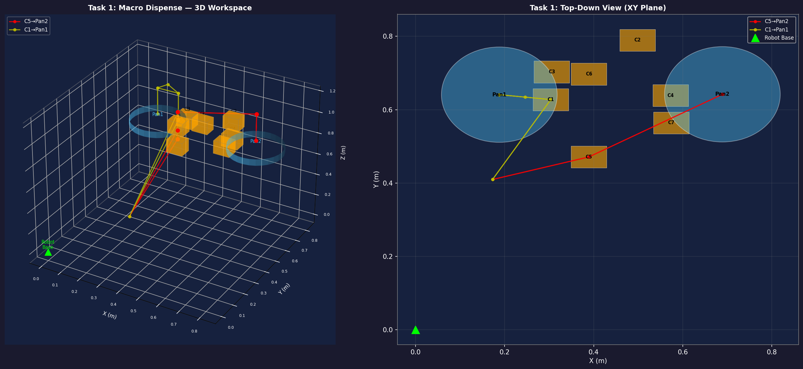
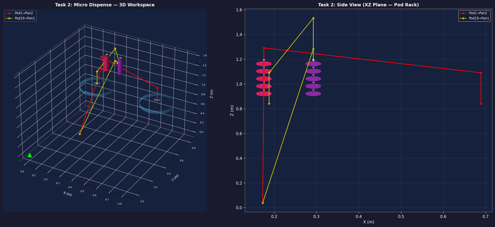
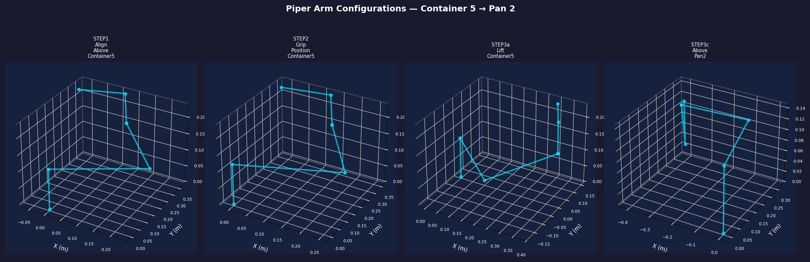

# POSHA Robotics — Path Planning Assignment
**Robotics Engineering Internship Assignment**  
**Rachit Trivedi | SRM IST Kattankulathur (ECE + Data Science, 2026)**
**Date: 02 April 2026**

---

## Overview

This repository implements path planning for the **Posha autonomous cooking robot** — a consumer kitchen robot with two cooking stations. The AgileX Piper 6-DOF robotic arm is programmed to:

- **Task 1 (Macro Dispense):** Pick macro ingredient containers and dispense into cooking pans
- **Task 2 (Micro Dispense):** Pick spice pods from the rack and dispense into pans

---

## Robot: AgileX Piper

| Spec | Value |
|------|-------|
| DOF | 6 (revolute) + 2 (prismatic gripper) |
| Max Reach | ~760mm |
| Payload | 1.5kg |
| Joint 1 Range | ±150° |
| Joint 2 Range | 0–180° |
| Joint 3 Range | -170°–0° |
| Joint 4 Range | ±100° |
| Joint 5 Range | ±70° |
| Joint 6 Range | ±120° |
| Gripper Stroke | 0–35mm per finger |

---

## Workspace Coordinates

All coordinates extracted from `POSHA_Robotics_Assignment.step` via FreeCAD Python console.

| Component | X (m) | Y (m) | Z (m) |
|-----------|--------|--------|--------|
| Robot Base | 0.000 | 0.000 | 0.000 |
| **Container 1** | 0.304 | 0.628 | 0.738 |
| **Container 5** | 0.389 | 0.471 | 0.737 |
| **Pan 1** | 0.188 | 0.641 | 0.741 |
| **Pan 2** | 0.689 | 0.642 | 0.740 |
| Spice Pod 1 (Col A) | 0.176 | 0.805 | 0.922 |
| Spice Pod 19 (Col B) | 0.293 | 0.805 | 1.042 |
| Stove | 0.046 | 0.867 | -0.187 |

---

## Path Planning Algorithm

### Macro Dispense (Task 1)
6-step sequence per assignment spec:

```
1. ALIGN     — Move gripper above container (safe Z clearance)
2. GRIP      — Descend to 5mm above rear lip; close gripper
3. LIFT      — Raise container to safe Z; transit above pan
4. DISPENSE  — Lower to 10cm above pan; tilt 180° to pour
5. RETURN    — Raise and transit back above container
6. PLACE     — Descend and release container at original position
```

### Micro Dispense (Task 2)
5-step sequence:

```
1. ALIGN     — Approach from front of rack; align with pod
2. GRIP      — Move actuator 2mm from pod surface; close gripper
3. LIFT      — Extract pod from rack; transit above pan
4. DISPENSE  — Lower to pan; tilt to pour spice
5. RETURN    — Return pod to exact rack position
```
## Visualizations

### Task 1 — Macro Dispense Path


### Task 2 — Micro Dispense Path

---

## Kinematics

### Forward Kinematics
Uses **Denavit-Hartenberg (DH) parameters** derived from URDF joint origins:

```
T_ee = T_1 × T_2 × T_3 × T_4 × T_5 × T_6
```

Each `T_i` is a 4×4 homogeneous transformation:
```
T_i = | cos(θ)  -sin(θ)cos(α)   sin(θ)sin(α)   a·cos(θ) |
      | sin(θ)   cos(θ)cos(α)  -cos(θ)sin(α)   a·sin(θ) |
      |   0       sin(α)          cos(α)           d      |
      |   0         0               0              1      |
```

### Inverse Kinematics
**Damped Least-Squares (DLS)** numerical IK:
```
Δq = J^T (JJ^T + λ²I)^{-1} Δx
```
- λ = 0.01 (damping factor for singularity avoidance)
- Max iterations: 500
- Tolerance: 0.1mm

---

### Arm Configurations at Key Waypoints


## Collision Detection

Bounding-sphere model for workspace objects:
- Stove: radius 0.25m
- Spice Rack: radius 0.18m
- Pan rims: radius 0.15m

Linear path segments sampled at 20 points; detour waypoint inserted if collision detected.

---

## File Structure

```
posha_robotics/
├── path_planning_macro.py   # Task 1: Macro dispense
├── path_planning_micro.py   # Task 2: Micro dispense
├── visualize.py             # 3D matplotlib visualizations
├── piper_description.urdf   # Robot URDF (AgileX Piper)
├── macro_path_results.json  # Output: waypoints + validation
├── micro_path_results.json  # Output: waypoints + validation
├── task1_macro_path.png     # Visualization: Task 1
├── task2_micro_path.png     # Visualization: Task 2
├── arm_configurations.png   # Arm poses at key waypoints
└── README.md
```

---

## Running the Code

### Requirements
```bash
pip install numpy matplotlib
```

### Execute
```bash
# Task 1: Macro dispense
python path_planning_macro.py

# Task 2: Micro dispense
python path_planning_micro.py

# Generate all visualizations
python visualize.py
```

---

## Assumptions

1. Robot base is at assembly origin (0,0,0) as shown in STEP file
2. Container dimensions: 120mm height, 80mm × 60mm footprint (estimated)
3. Spice pod diameter: 35mm (from `PodShaft 35x2.5mm_dia` in CAD)
4. Pan dispense height: 100mm above pan surface for clean pour
5. Safe transit Z: 250mm above highest workspace object
6. All coordinates in metres; STEP file extracted in millimetres
7. Gripper payload (1.2kg) < arm capacity (1.5kg) ✅

---

## Hardware Implementation Recommendations

1. **Mount robot base** at assembly origin with 6-bolt flange
2. **Use force-torque sensor** at wrist for container gripping feedback
3. **Add vision system** (RGB-D camera) for container pose correction
4. **Implement soft real-time control** at 100Hz joint control loop
5. **Add thermal shielding** on arm links nearest to stove heating element

---

*Assignment submitted as part of Posha Robotics Engineering Internship process.*
